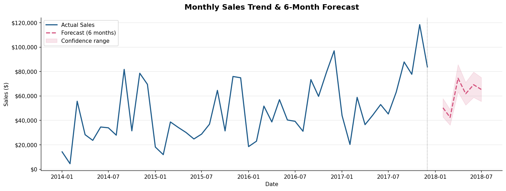
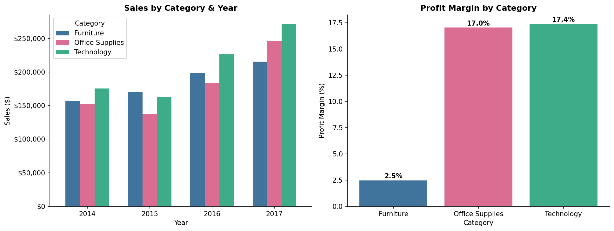
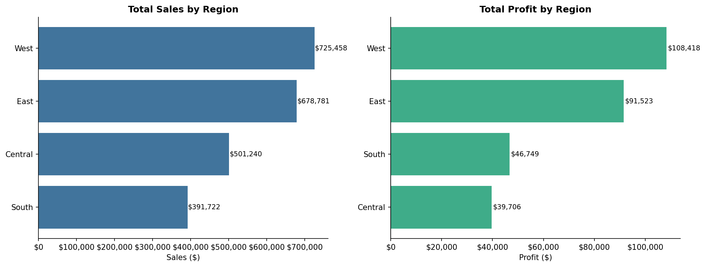
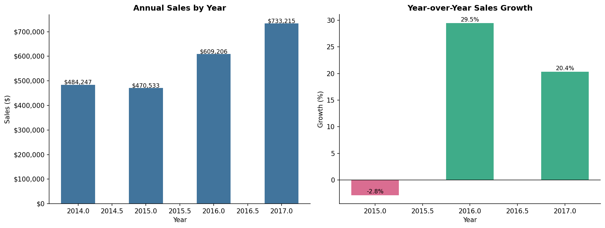

# 📈 Sales Forecasting & Performance Analysis


An end-to-end sales analysis and forecasting project using the Superstore dataset. Covers 4 years of sales data across 3 product categories and 4 US regions, with a 6-month exponential smoothing forecast and an interactive Tableau dashboard.

---

## 📊 Interactive Dashboard

🔗 **[View Live Tableau Dashboard →](https://public.tableau.com/app/profile/nunj.patel/viz/SalesPrediction_17755410391540/Dashboard1)**

---

## 🔍 Key Findings

| Metric | Value |
|---|---|
| Total revenue (2014–2017) | **$2,297,201** |
| Total profit | **$286,397** |
| Overall profit margin | **12.5%** |
| Total orders | **5,009** |
| Total customers | **793** |
| Best performing region | **West ($725,458)** |
| Most profitable category | **Technology (17.4% margin)** |
| Lowest margin category | **Furniture (2.5% margin)** |

**Notable insights:**
- 📉 Sales dipped **-2.8%** in 2015 before recovering strongly
- 🚀 Sales grew **+29.5%** in 2016 and **+20.4%** in 2017 — strong upward trend
- 🪑 Furniture generates high revenue but only **2.5% profit margin** — a pricing/cost problem
- 🖥️ Technology has both strong sales growth AND the highest margin at **17.4%**
- 🌍 West region leads in both sales ($725K) and profit ($108K)
- 📦 Central region has the lowest profit ($39K) despite $501K in sales
- 🔮 6-month forecast projects continued growth into 2018 based on seasonal patterns

---

## 📈 Visualisations

### Monthly Sales Trend & 6-Month Forecast


### Sales & Profit Margin by Category


### Regional Sales & Profit Performance


### Year-over-Year Sales Growth


---

## 🔮 Forecasting Methodology

**Model:** Exponential Smoothing (Holt-Winters)
**Seasonal periods:** 12 months
**Trend component:** Additive
**Seasonal component:** Additive
**Forecast horizon:** 6 months

The model captures both the upward trend and seasonal patterns (Q4 sales spikes) visible in the historical data. The forecast projects monthly sales in the **$50K–$75K range** for early 2018, consistent with the seasonal pattern observed in prior years.

---

## 🛠️ Tools & Technologies

| Category | Tools |
|---|---|
| Language | Python 3.8 |
| Data manipulation | Pandas, NumPy |
| Forecasting | Statsmodels (Holt-Winters) |
| Visualization | Matplotlib, Seaborn |
| Dashboard | Tableau Public |
| Dataset | Superstore Sales Dataset (Kaggle) |

---

## 📁 Project Structure

```
sales-forecasting/
│
├── data/
│   ├── Sample - Superstore.csv          # Raw dataset
│   ├── tableau_monthly_sales.csv        # Monthly aggregated sales
│   ├── tableau_category.csv             # Sales & profit by category/year
│   ├── tableau_region.csv               # Sales & profit by region/year
│   └── tableau_main.csv                 # Full cleaned dataset
│
├── notebooks/
│   └── 01_analysis.ipynb                # Full analysis + forecasting notebook
│
├── outputs/
│   └── charts/                          # Exported PNG visualizations
│
└── README.md
```

---

## ▶️ How to Run

```bash
# Clone the repo
git clone https://github.com/Nunjpatel/sales-forecasting.git
cd sales-forecasting

# Create virtual environment
python -m venv venv
venv\Scripts\activate        # Windows
source venv/bin/activate     # Mac/Linux

# Install dependencies
pip install pandas numpy matplotlib seaborn statsmodels jupyter ipykernel

# Launch notebook
jupyter notebook notebooks/01_analysis.ipynb
```

**Dataset:** [Superstore Sales Dataset — Kaggle](https://www.kaggle.com/datasets/vivek468/superstore-dataset-final)

---

## 🚀 What I'd Add Next

- ARIMA or Prophet model for more robust forecasting with confidence intervals
- Sub-category drill-down — which specific products drive the Furniture margin problem?
- Customer segmentation analysis — which customer segments are most profitable?
- Discount impact analysis — are heavy discounts hurting margins in certain categories?

---

## 👤 Author

**Nunj Patel** · Data Analyst · Toronto, Canada
[LinkedIn](https://www.linkedin.com/in/nunjpatel/) · [GitHub](https://github.com/Nunjpatel) · nunjpatel@gmail.com
